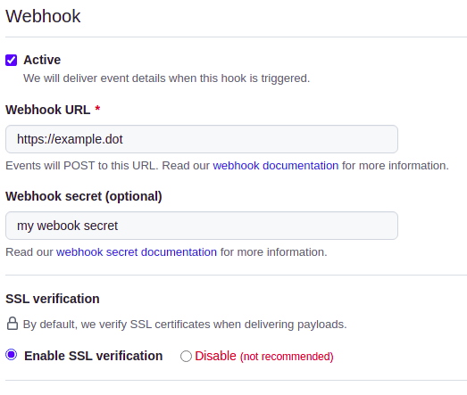

<h2 align="center"> Gotcha Bot :robot: </h2>
<h2 align="center">A app to automate engineers tasks</h2>

---
## What can :robot: do?

> *Gotcha*, is a app and works on fired events. For more details on a GitHub app, please check [here](https://docs.github.com/en/developers/apps/getting-started-with-apps/about-apps).

The features of *Gotcha* are:

- Ensure the **pull request** name is valid.
- Ensure the **pull request** labels are valid.
- Ensure the **pull request** assigners are valid.
- Ensure the **pull request** reviewers are valid.

*Gotcha* implements the features as a test suite. Therefore, adding a new functionality for validation is very simple and practical.

## How to install

### GitHub app
First, go to your profile *Settings* &#8594; *Developer Settings*. Then create a GitHub app called *Gotcha* :smiley:.

Fill in the necessary information to create the app.  

To test without hosting or exposing your application on the internet, a suggestion is to use https://smee.io

Next, enable the following permissions:

- Repository &#8594; Checks
- Repository &#8594; Issues
- Repository &#8594; Pull requests
- Repository &#8594; Contents
- Events &#8594; Check run
- Events &#8594; Issue comment
- Events &#8594; Issues
- Events &#8594; Pull request
- Events &#8594; Pull request review comment
- Events &#8594; Pull request review

> It's worth noting that the permissions listed are *Gotcha's* default ones. If you are not interested in using some functionality or have another need, customize the permissions.

Finally, save the settings and "install" it in your profile.
Afterwards, generate a private key for the bot.

### Gotcha Settings

In the *build* folder, you will find a file called **config.yaml** which is intended to configure some features of Gotcha.

- In **Layout**, you'll find general *Gotcha* settings.
- In **GitHub**, you'll find general GitHub settings.

**Layout**: 

| Level                                                  | Description                                                                                                                                                                                           | Type          | Default                                                                                             |
|--------------------------------------------------------|-------------------------------------------------------------------------------------------------------------------------------------------------------------------------------------------------------|---------------|-----------------------------------------------------------------------------------------------------|
| administration &#8594; permission                      | Users who are allowed to execute commands such as pull request approval, test re-runs and others.   The permissions here are one level above the *repositories* item, so they overlap the others. | list(string)  | None                                                                                                |
| administration &#8594; permission &#8594; repositories | Users with permissions on certain repositories.                                                                                                                                                       | list(object)  | None                                                                                                |
| pullRequest &#8594; approveCommand                     | Command for approval of the PR by *Gotcha*.                                                                                                                                                           | string        | lgtm                                                                                                |
| pullRequest &#8594; runTestSuiteCommand                | Command to re-run the test suite.                                                                                                                                                                     | string        | run testsuite                                                                                       |
| pullRequest &#8594; mergeCommand                       | Command for merge of the PR by *Gotcha*.                                                                                                                                                              | string        | merge                                                                                               |
| pullRequest &#8594; mergeAndDeleteCommand              | Command for merge and delete ref branch of the PR by *Gotcha*.                                                                                                                                        | string        | merge and delete                                                                                    |
| pullRequest &#8594; testSuite &#8594; namePattern      | Format (regex) that pull request name must follow.  Default value is based on [Conventional Commits](https://www.conventionalcommits.org/en/v1.0.0/).                                             | string(regex) | (?P<type>feat&#124;fix&#124;refactor&#124;style&#124;docs&#124;build)(?P<separator>:) (?P<body>.+)' |
| pullRequest &#8594; testSuite &#8594; reviewers        | Need to have reviewers on the pull request.                                                                                                                                                           | bool          | false                                                                                               |
| pullRequest &#8594; testSuite &#8594; assignees        | Need to have assignees on the pull request.                                                                                                                                                           | bool          | true                                                                                                |
| pullRequest &#8594; testSuite &#8594; labels           | Need to have labels on the pull request.                                                                                                                                                              | bool          | true                                                                                                |

**Github**:

| Level              | Description                                               | Type         | Default                                                                                              |
|--------------------|-----------------------------------------------------------|--------------|------------------------------------------------------------------------------------------------------|
| appId              | GitHub App Id.                                            | int          | None(required)                                                                                       |
| organization       | Name of the organization that *Gotcha* will be installed. | string       | None                                                                                                 |
| user               | Name of the user that *Gotcha* will be installed.         | string       | None                                                                                                 |
| webhookSecret      | Webhook secret.                                           | string       | None(required)                                                                                       |
| privateKeyLocation | Private key location.                                     | string       | None                                                                                                 |
| privateKey         | Private key value.                                        | string       | None                                                                                                 |
| events             | List of events that *Gotcha* will listen to.              | list(string) | issue   pull_request   pull_request_review_comment   pull_request_review   check_run |

## Contributing
Gotcha is an open source bot made to facilitate developers' daily lives. Thus, all features are open to be modified and/or added.

 Please feel free to help!  

 For more details, see our <a href="CONTRIBUTING.md"> guide.</a>
 