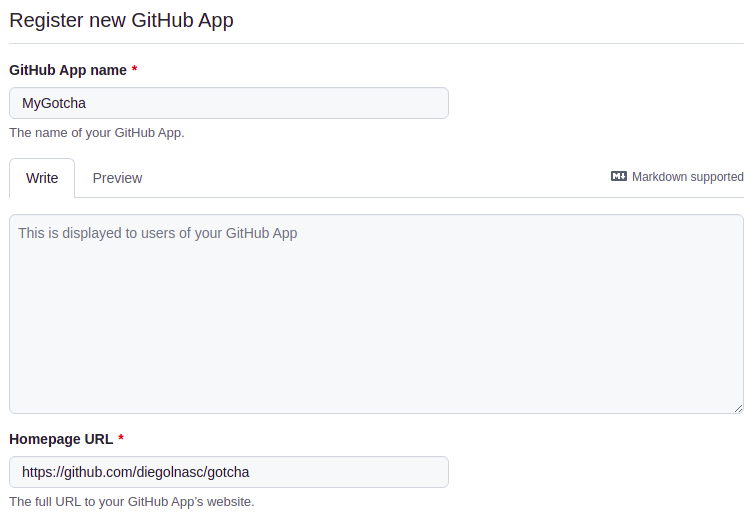

<h2 align="center"> Gotcha Bot :robot: </h2>
<h2 align="center">A app to automate engineers tasks</h2>

---
## What can :robot: do?

> Gotcha, is a app and works on fired events. For more details on a Github app, please check [here](https://docs.github.com/en/developers/apps/getting-started-with-apps/about-apps).

The features of *gotcha* are:

- Ensure the **pull request** name is valid.
- Ensure the **pull request** labels are valid.
- Ensure the **pull request** assigneers are valid.
- Ensure the **pull request** reviewers are valid.

*Gotcha* implements the features as a test suite. Therefore, adding a new functionality for validation is very simple and practical.

## How to install

### Github app
First, go to your profile *Settings* &#8594; *Developer Settings*. Then create a github app called *Gotcha* :smiley:.

Fill in the necessary information to create the app.

To test without hosting or exposing your application on the internet, a suggestion is to use https://smee.io

Next, enable the following permissions:

- Repository &#8594; Checks
- Repository &#8594; Issues
- Repository &#8594; Pull requests
- Events &#8594; Check run
- Events &#8594; Issue comment
- Events &#8594; Issues
- Events &#8594; Pull request
- Events &#8594; Pull request review comment
- Events &#8594; Pull request review

> It's worth noting that the permissions listed are *Gotcha's* default ones. If you are not interested in using some functionality or have another need, customize the permissions.

Finally, save the settings and "install" it in your profile.
Afterwards, generate a private key for the bot.

### Gotcha Settings

In the *build* folder, you will find a file called **config.yaml** which is intended to configure some features of Gotcha.

### Layout

In **Layout**, you'll find general Gotcha settings.

### Github

## Contributing
Gotcha is an open source bot made to facilitate developers' daily lives. Thus, all features are open to be modified and/or added.

 Please feel free to help!  

 For more details, see our <a href="CONTRIBUTING.md"> guide.
 